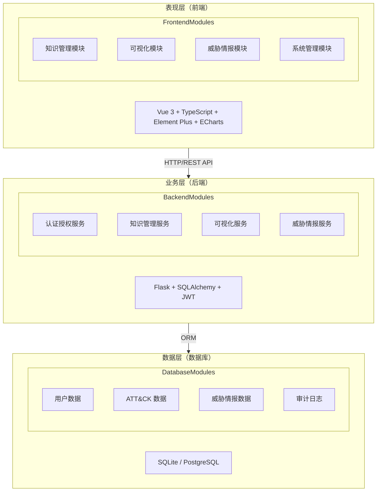
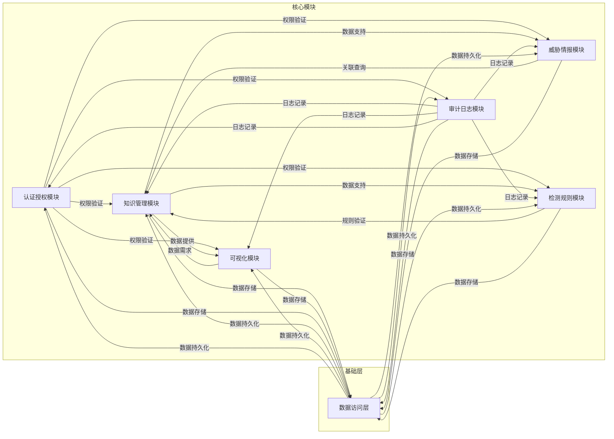
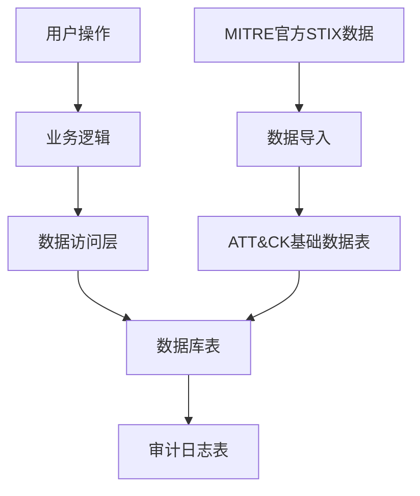
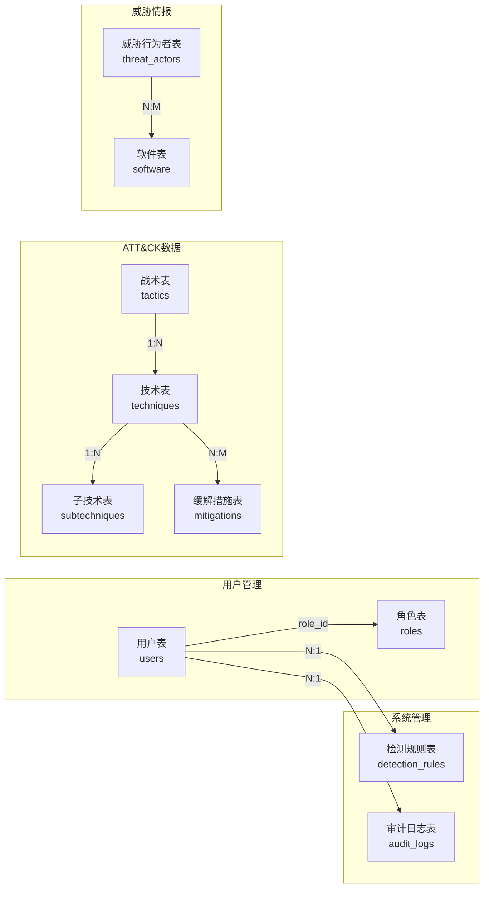

# 网络安全攻击知识库系统 - 概要设计说明书

## 文档信息

| 项目 | 内容 |
|------|------|
| 文档名称 | 概要设计说明书 |
| 版本号 | V1.0 |
| 编制日期 | 2026-03-03 |
| 编制人 | 系统开发团队 |

---

## 1. 引言

### 1.1 编写目的

本文档旨在描述网络安全攻击知识库系统的概要设计，包括系统架构、功能模块、数据模型、接口设计等内容，为详细设计和开发实施提供依据。

### 1.2 项目背景

随着网络安全威胁日益复杂化，组织需要系统化的方法来理解和防御各种攻击手段。MITRE ATT&CK框架作为业界公认的威胁建模和防御框架，提供了全面的攻击技术知识库。本系统基于ATT&CK框架，构建一个可视化的攻击知识管理平台。

**项目发起原因**：
- 传统安全知识分散，缺乏系统化整理
- 安全团队需要快速查询攻击技术和防御措施
- 缺乏可视化的攻击路径分析工具
- 威胁情报管理效率低下

**项目目标**：构建一个集知识管理、可视化分析、威胁情报于一体的攻击知识库系统。

### 1.3 读者对象

| 读者类型 | 阅读目的 |
|----------|----------|
| 项目经理 | 了解系统整体架构，进行项目规划和管理 |
| 系统架构师 | 理解设计思路，指导详细设计 |
| 开发工程师 | 了解模块划分，进行编码实现 |
| 测试工程师 | 理解功能需求，设计测试用例 |
| 运维工程师 | 了解部署架构，进行系统部署和维护 |

### 1.4 参考资料

| 编号 | 文档名称 | 版本 | 来源 |
|------|----------|------|------|
| 1 | MITRE ATT&CK Framework | v14.0 | https://attack.mitre.org/ |
| 2 | MITRE ATT&CK STIX Data | v18.1 | https://github.com/mitre-attack/attack-stix-data |
| 3 | Flask Documentation | 3.0.x | https://flask.palletsprojects.com/ |
| 4 | Vue 3 Documentation | 3.4.x | https://vuejs.org/ |
| 5 | Element Plus Documentation | 2.5.x | https://element-plus.org/ |
| 6 | RESTful API Design Guidelines | - | https://restfulapi.net/ |

### 1.5 术语定义

| 术语 | 英文全称 | 定义 |
|------|----------|------|
| ATT&CK | Adversarial Tactics, Techniques, and Common Knowledge | 对抗战术、技术和通用知识框架，MITRE开发的威胁建模框架 |
| Tactic | Tactic | 战术，攻击者的战术目标，如Initial Access（初始访问） |
| Technique | Technique | 技术，攻击者实现战术目标的具体方法，如Phishing（钓鱼攻击） |
| Sub-technique | Sub-technique | 子技术，技术的细分变体，如Spearphishing Attachment（鱼叉式钓鱼附件） |
| Mitigation | Mitigation | 缓解措施，防御或减轻攻击技术的方法 |
| Threat Actor | Threat Actor | 威胁行为者，实施攻击的组织或个人，如APT组织 |
| IOC | Indicator of Compromise | 失陷指标，表明系统可能被入侵的证据 |
| TTP | Tactics, Techniques, and Procedures | 战术、技术和程序，描述攻击者行为的完整模式 |
| STIX | Structured Threat Information Expression | 结构化威胁信息表达，威胁情报共享标准 |
| JWT | JSON Web Token | 基于JSON的开放标准，用于创建访问令牌 |
| RBAC | Role-Based Access Control | 基于角色的访问控制 |
| ORM | Object-Relational Mapping | 对象关系映射，如SQLAlchemy |

---

## 2. 总体设计目标与原则

### 2.1 功能目标

#### 2.1.1 核心功能目标

| 功能类别 | 目标描述 | 优先级 |
|----------|----------|--------|
| 知识管理 | 完整管理ATT&CK框架的战术、技术、子技术、缓解措施 | 高 |
| 可视化分析 | 提供矩阵、图谱等多种可视化方式展示攻击路径 | 高 |
| 威胁情报 | 整合威胁行为者信息，支持关联分析和追踪 | 高 |
| 检测规则 | 支持自定义检测规则的管理、验证和应用 | 中 |
| 权限控制 | 基于RBAC的细粒度权限控制 | 高 |
| 审计日志 | 完整的操作审计和由志记录 | 中 |

#### 2.1.2 扩展功能目标

| 功能类别 | 目标描述 | 优先级 |
|----------|----------|--------|
| 数据导入导出 | 支持MITRE官方数据的导入和自定义导出 | 中 |
| API接口 | 提供RESTful API供第三方系统集成 | 中 |
| 多语言支持 | 支持中英文切换 | 低 |

### 2.2 性能目标

| 性能指标 | 目标值 | 说明 |
|----------|--------|------|
| 页面加载时间 | < 3秒 | 首屏加载时间 |
| API响应时间 | < 500ms | 95%的API请求响应时间 |
| 并发用户数 | > 100 | 同时在线用户数 |
| 数据查询时间 | < 1秒 | 复杂查询的响应时间 |
| 系统可用性 | > 99.5% | 年度可用性目标 |
| 数据容量 | 100万+ | 支持的数据记录数 |

### 2.3 安全目标

| 安全目标 | 具体要求 | 实现方式 |
|----------|----------|----------|
| 身份认证 | 确保用户身份真实性 | JWT令牌认证 |
| 访问控制 | 防止未授权访问 | RBAC权限控制 |
| 数据加密 | 保护敏感数据 | bcrypt密码加密、HTTPS传输 |
| 审计追踪 | 记录所有操作 | 完整的审计日志 |
| 输入验证 | 防止注入攻击 | 参数化查询、输入校验 |
| 会话安全 | 防止会话劫持 | Token过期机制、刷新机制 |

### 2.4 设计原则

#### 2.4.1 模块化原则

- **高内聚**：每个模块只负责一类功能，内部元素紧密相关
- **低耦合**：模块间通过标准接口通信，减少相互依赖
- **单一职责**：每个类/函数只负责一项职责
- **接口隔离**：客户端不应该依赖它不需要的接口

#### 2.4.2 可扩展性原则

- ****开闭原则**：对扩展开放，对修改关闭
- **插件化架构**：支持功能模块的动态加载
- **配置化设计**：通过配置而非代码修改了现功能调整
- **预留扩展点**：在关键位置预留扩展接口

#### 2.4.3 可维护性原则

- **代码规范**：遵循PEP8（Python）和ESLint（JavaScript）规范
- **文档完整**：代码注释、API文档、设计文档齐全
- **日志完善**：关键操作和异常都有日志记录
- **测试覆盖**：单元测试覆盖率>80%

#### 2.4.4 可靠性原则

- **容错处理**：异常情况下系统仍能正常运行
- **数据备份**：定期自动备份，支持快速恢复
- **限流保护**：防止系统过载
- **监控告警**：实时监控系统状态

---

## 3. 运行环境

### 3.1 硬件环境

#### 3.1.1 服务器环境

| 组件 | 最低配置 | 推荐配置 | 说明 |
|------|----------|----------|------|
| CPU | 4核 | 8核+ | Intel Xeon或AMD EPYC |
| 内存 | 8GB | 16GB+ | DDR4 ECC |
| 硬盘 | 100GB SSD | 500GB SSD+ | 系统盘+数据盘 |
| 网络 | 100Mbps | 1Gbps+ | 内网/公网带宽 |

#### 3.1.2 终端环境

| 组件 | 最低配置 | 说明 |
|------|----------|------|
| CPU | 2核 | 现代处理器 |
| 内存 | 4GB | 浏览器运行内存 |
| 显示器 | 1920×1080 | 推荐分辨率 |
| 网络 | 10Mbps | 稳定网络连接 |

#### 3.1.3 网络环境

| 项目 | 要求 | 说明 |
|------|------|------|
| 网络类型 | TCP/IP | 支持IPv4/IPv6 |
| 端口要求 | 5000（后端）、5174（前端） | 可配置 |
| 防火墙 | 开放必要端口 | 根据部署环境调整 |
| 带宽 | 100Mbps+ | 根据并发用户数调整 |

### 3.2 软件环境

#### 3.2.1 操作系统

| 组件 | 版本要求 | 说明 |
|------|----------|------|
| 服务器OS | Linux（Ubuntu 20.04+/CentOS 7+）或Windows Server 2019+ | 推荐Linux |
| 客户端OS | Windows 10+/macOS 10.15+/Linux | 现代浏览器支持 |

#### 3.2.2 数据库

| 组件 | 版本要求 | 说明 |
|------|----------|------|
| SQLite | 3.35+ | 开发/测试环境 |
| PostgreSQL | 12+ | 生产环境推荐 |

#### 3.2.3 中间件

| 组件 | 版本要求 | 说明 |
|------|----------|------|
| Nginx | 1.18+ | 反向代理（可选） |
| Redis | 6.0+ | 缓存（可选） |

#### 3.2.4 开发框架

| 组件 | 版本要求 | 说明 |
|------|----------|------|
| Python | 3.9+ | 后端开发语言 |
| Flask | 3.0.x | 后端Web框架 |
| SQLAlchemy | 2.0+ | ORM框架 |
| Flask-JWT-Extended | 4.5+ | JWT认证 |
| Node.js | 18+ | 前端构建工具 |
| Vue | 3.4.x | 前端框架 |
| TypeScript | 5.3.x | 前端类型系统 |
| Element Plus | 2.5.x | UI组件库 |
| ECharts | 5.4.x | 可视化库 |
| Vite | 5.0.x | 前端构建工具 |

---

## 4. 总体架构设计

### 4.1 系统分层架构

**架构说明**：系统采用经典的B/S三层架构，前后端分离设计，各层职责明确，边界清晰，便于系统的开发、维护和扩展。

**各层职责**：
1. **表现层（前端）**：
   - 负责用户界面的展示和用户交互
   - 包含知识管理、可视化分析、威胁情报和系统管理等前端模块
   - 使用Vue 3 + TypeScript + Element Plus + ECharts技术栈

2. **业务层（后端）**：
   - 负责业务逻辑的处理和实现
   - 包含认证授权、知识管理、可视化和威胁情报等后端服务
   - 使用Flask + SQLAlchemy + JWT技术栈

3. **数据层（数据库）**：
   - 负责数据的存储和管理
   - 包含用户数据、ATT&CK数据、威胁情报数据和审计日志等
   - 支持SQLite（开发/测试环境）和PostgreSQL（生产环境）

**数据流向**：前端通过HTTP/REST API向后端发送请求，后端通过ORM与数据库进行交互，实现数据的增删改查操作。



### 4.2 模块划分

| 模块名称 | 层级 | 职责描述 |
|----------|------|----------|
| 认证授权模块 | 业务层 | 用户登录、JWT令牌管理、权限验证 |
| 知识管理模块 | 业务层 | ATT&CK数据的CRUD操作、搜索、分类 |
| 可视化模块 | 业务层表示层 | 攻击矩阵、图谱、路径分析数据生成 |
| 威胁情报模块 | 业务层 | 威胁行为者管理、关联分析 |
| 检测规则模块 | 业务层 | 规则管理、验证、导出 |
| 审计日志模块 | 业务层 | 操作日志记录、查询、分析 |
| 数据访问层 | 数据层 | 数据库操作、ORM映射、事务管理 |

### 4.3 模块关系

**关系说明**：模块关系图描述了系统各模块之间的依赖和交互关系，展示了模块间的数据流向和调用关系。

**核心关系**：
1. **认证授权模块**：
   - 对所有业务模块进行权限验证，是系统的安全基础
   - 与数据访问层交互，存储和查询用户权限数据

2. **知识管理模块**：
   - 为可视化模块、威胁情报模块和检测规则模块提供数据支持
   - 与数据访问层交互，存储和查询ATT&CK框架数据

3. **可视化模块**：
   - 从知识管理模块获取数据，生成可视化图表和分析结果
   - 与数据访问层交互，存储和查询可视化配置数据

4. **威胁情报模块**：
   - 从知识管理模块获取关联数据，进行威胁行为者分析
   - 与数据访问层交互，存储和查询威胁情报数据

5. **检测规则模块**：
   - 从知识管理模块获取数据，验证检测规则的有效性
   - 与数据访问层交互，存储和查询检测规则数据

6. **审计日志模块**：
   - 记录所有业务模块的操作日志，提供审计追踪能力
   - 与数据访问层交互，存储和查询审计日志数据

7. **数据访问层**：
   - 为所有业务模块提供数据持久化服务
   - 处理数据库操作、ORM映射和事务管理



### 4.4 系统拓扑图

**拓扑说明**：系统拓扑图描述了系统的部署架构和网络连接关系，展示了用户浏览器、反向代理、前端服务、后端API和数据库之间的通信方式。

**部署架构**：
1. **用户浏览器**：用户通过浏览器访问系统，支持直接访问前端服务、后端API和数据库，或通过Nginx反向代理访问。

2. **Nginx反向代理**（可选）：
   - 作为系统的入口点，处理HTTPS请求
   - 反向代理到前端服务和后端API
   - 提供负载均衡和SSL终止功能

3. **前端服务**：
   - 运行在端口5174，使用Vite构建工具
   - 提供用户界面和交互功能
   - 向后端API发送请求获取数据

4. **后端API**：
   - 运行在端口5000，使用Flask框架
   - 处理业务逻辑和数据处理
   - 与数据库进行交互

5. **数据库**：
   - 运行在端口5432，使用PostgreSQL
   - 存储系统数据，包括用户数据、ATT&CK数据、威胁情报数据和审计日志

**网络通信**：
- 用户浏览器与Nginx之间使用HTTPS协议
- 前端服务与后端API之间使用HTTP/REST API
- 后端API与数据库之间使用数据库协议

```mermaid
graph LR
    subgraph 用户层
        UserBrowser[用户浏览器]
    end
    
    subgraph 代理层
        Nginx[nginx 反向代理
(可选)]
    end
    
    subgraph 应用层
        Frontend[前端服务
:5174 (Vite)]
        Backend[后端API
:5000 (Flask)]
    end
    
    subgraph 数据层
        Database[数据库
:5432 (PostgreSQL)]
    end
    
    UserBrowser -->|HTTPS| Nginx
    Nginx --> Frontend
    Nginx --> Backend
    
    UserBrowser -->|直接访问| Frontend
    UserBrowser -->|直接访问| Backend
    
    Frontend -->|API请求| Backend
    Backend -->|数据操作| Database
```

### 4.5 部署图

**开发环境**：
- 前端：`npm run dev` → http://localhost:5174
- 后端：`python run.py` → http://localhost:5000
- 数据库：SQLite（本地文件）

**生产环境**：
- Nginx：反向代理，SSL终止
- 前端：静态文件部署
- 后端：Gunicorn/uWSGI + Flask
- 数据库：PostgreSQL（独立服务器）

---

## 5. 功能模块设计

### 5.1 认证授权模块

#### 5.1.1 功能概述

提供用户身份认证和基于角色的访问控制功能。

#### 5.1.2 主要功能

| 功能名称 | 功能描述 | 输入 | 输出 |
|----------|----------|------|------|
| 用户登录 | 验证用户名密码，返回JWT令牌 | username, password | access_token, refresh_token |
| 令牌刷新 | 刷新过期的访问令牌 | refresh_token | access_token |
| 权令验证 | 验证用户权限 | token, resource, action | boolean |
| 用户管理 | 创建、更新、删除用户 | user_data | success/failure |
| 角色管理 | 管理角色和权限 | role_data | success/failure |

#### 5.1.3 模块接口

```
POST /api/auth/login          - 用户登录
POST /api/auth/refresh        - 刷新令牌
POST /api/auth/logout         - 用户登出
GET  /api/auth/profile        - 获取用户信息
PUT  /api/auth/profile        - 更新用户信息
GET  /api/auth/users          - 获取用户列表（管理员）
POST /api/auth/users          - 创建用户（管理员）
PUT  /api/auth/users/:id      - 更新用户（管理员）
DELETE /api/auth/users/:id    - 删除用户（管理员）
```

### 5.2 知识管理模块

#### 5.2.1 功能概述

管理MITRE ATT&CK框架的战术、技术、子技术、缓解措施等。

#### 5.2.2 主要功能

| 功能名称 | 功能描述 | 输入 | 输出 |
|----------|----------|------|:------|
| 战术查询 | 获取所有战术或指定战术 | tactic_id | tactic_list |
| 技术查询 | 获取技术列表，支持筛选 | filters | technique_list |
| 子技术查询 | 获取子技术列表 | technique_id | subtechnique_list |
| 缓解措施查询 | 获取缓解措施列表 | filters | mitigation_list |
| 全文搜索 | 全文搜索ATT&CK数据 | keyword | search_results |
| 数据导入 | 导入MITRE官方STIX数据 | stix_file | import_result |
| 数据导出 | 导出自定义数据 | filters, format | export_file |

#### 5.2.3 模块接口

```
GET  /api/tactics              - 获取所有战术
GET  /api/tactics/:id          - 获取指定战术
GET  /api/techniques           - 获取技术列表
GET  /api/techniques/:id       - 获取指定技术
GET  /api/subtechniques        - 获取子技术列表
GET  /api/subtechniques/:id    - 获取指定子技术
GET  /api/mitigations          - 获取缓解措施
GET  /api/mitigations/:id      - 获取指定缓解措施
GET  /api/search               - 全文搜索
POST /api/import               - 导入数据
GET  /api/export               - 导出数据
```

### 5.3 可视化模块

#### 5.3.1 功能概述

提供攻击矩阵、图谱、路径分析等可视化数据。

#### 5.3.2 主要功能

| 功能名称 | 功能描述 | 输入 | 输出 |
|----------|----------|------|------|
| 攻击矩阵 | 生成ATT&CK矩阵数据 | domain, filters | matrix_data |
| 攻击图谱 | 生成力导向图数据 | filters | graph_data |
| 攻击路径 | 生成攻击路径分析数据 | source, target | path_data |
| 关联分析 | 生成关联关系图 | entity_id | relation_data |

#### 5.3.3 模块接口

```
GET  /api/visualization/matrix      - 获取攻击矩阵数据
GET  /api/visualization/graph        - 获取攻击图谱数据
GET  /api/visualization/attack-paths - 获取攻击路径数据
GET  /api/visualization/relations    - 获取关联关系数据
```

### 5.4 威胁情报模块

#### 5.4.1 功能概述

管理威胁行为者信息，支持关联分析。

#### 5.4.2 主要功能

| 功能名称 | 功能描述 | 输入 | 输出 |
|----------|----------|------|------|
| 威胁行为者查询 | 获取威胁行为者列表 | filters | actor_list |
| 关联技术查询 | 查询行为者使用的技术 | actor_id | technique_list |
| 关联软件查询 | 查询行为者使用的软件 | actor_id | software_list |
| 时间线分析 | 生成行为者活动时间线 | actor_id | timeline_data |

#### 5.4.3 模块接口

```
GET  /api/threat-actors         - 获取威胁行为者列表
GET  /api/threat-actors/:id     - 获取指定威胁行为者
GET  /api/threat-actors/:id/techniques - 获取关联技术
GET  /api/threat-actors/:id/software   - 获取关联软件
GET  /api/threat-actors/:id/timeline   - 获取时间线
```

### 5.5 检测规则模块

#### 5.5.1 功能概述

管理自定义检测规则，支持验证和导出。

#### 5.5.2 主要功能

| 功能名称 | 功能描述 | 输入 | 输出 |
|----------|----------|------|------|
| 规则管理 | 创建、更新、删除规则 | rule_data | success/failure |
| 规则查询 | 获取规则列表 | filters | rule_list |
| 规则验证 | 验证规则语法 | rule_content | validation_result |
| 规则导出 | 导出为Sigma/YAML格式 | rule_id | export_file |

#### 5.5.3 模块接口

```
GET  /api/detection-rules       - 获取检测规则列表
POST /api/detection-rules       - 创建检测规则
GET  /api/detection-rules/:id   - 获取指定规则
PUT  /api/detection-rules/:id   - 更新检测规则
DELETE /api/detection-rules/:id - 删除检测规则
POST /api/detection-rules/validate - 验证规则
GET  /api/detection-rules/:id/export - 导出规则
```

### 5.6 审计日志模块

#### 5.6.1 功能概述

记录所有操作日志，支持查询和分析。

#### 5.6.2 主要功能

| 功能名称 | 功能描述 | 输入 | 输出 |
|----------|----------|------|------|
| 日志记录 | 记录操作日志 | log_data | success |
| 日志查询 | 查询操作日志 | filters | log_list |
| 日志统计 | 统计操作数据 | time_range | statistics |
| 日志导出 | 导出日志文件 | filters, format | export_file |

#### 5.6.3 模块接口

```
GET  /api/audit-logs           - 获取审计日志
GET  /api/audit-logs/:id       - 获取指定日志
GET  /api/audit-logs/statistics - 获取统计数据
GET  /api/audit-logs/export    - 导出日志
```

---

## 6. 数据库概要设计

### 6.1 数据分类

| 数据类别 | 说明 | 数据量级 |
|----------|------|----------|
| ATT&CK基础数据 | 战术、技术、子技术、缓解措施 | ~1000条 |
| 威胁情报数据 | 威胁行为者、软件、关系 | ~500条 |
| 用户数据 | 用户、角色、权限 | ~100条 |
| 业务数据 | 检测规则、自定义数据 | ~1000条 |
| 日志数据 | 操作日志、审计记录 | 持续增长 |

### 6.2 数据流向



### 6.3 主要数据表

| 表名 | 说明 | 主要字段 |
|------|------|----------|
| users | 用户表 | id, username, password_hash, email, role_id |
| roles | 角色表 | id, name, description, permissions |
| tactics | 战术表 | id, name, description, domain, order |
| techniques | 技术表 | id, name, description, tactic_id, domain |
| subtechniques | 子技术表 | id, name, description, technique_id |
| mitigations | 缓解措施表 | id, name, description, technique_ids |
| threat_actors | 威胁行为者表 | id, name, description, aliases |
| software | 软件表 | id, name, description, type |
| detection_rules | 检测规则表 | id, name, content, created_by |
| audit_logs | 审计日志表 | id, user_id, action, resource, timestamp |

### 6.4 实体关系（ER图）

**关系说明**：实体关系图描述了系统数据库中各个表之间的关联关系，展示了表与表之间的主键-外键关系和数据流向。

**核心关系**：
1. **用户管理**：
   - 用户表（users）与角色表（roles）之间是多对一关系，一个用户属于一个角色，一个角色可以包含多个用户
   - 通过role_id外键关联

2. **ATT&CK数据**：
   - 战术表（tactics）与技术表（techniques）之间是一对多关系，一个战术包含多个技术，一个技术属于一个战术
   - 技术表（techniques）与子技术表（subtechniques）之间是一对多关系，一个技术可以包含多个子技术，一个子技术属于一个技术
   - 技术表（techniques）与缓解措施表（mitigations）之间是多对多关系，一个技术可以有多个缓解措施，一个缓解措施可以对应多个技术

3. **威胁情报**：
   - 威胁行为者表（threat_actors）与软件表（software）之间是多对多关系，一个威胁行为者可以使用多个软件，一个软件可以被多个威胁行为者使用

4. **系统管理**：
   - 用户表（users）与检测规则表（detection_rules）之间是一对多关系，一个用户可以创建多个检测规则，一个检测规则属于一个用户
   - 用户表（users）与审计日志表（audit_logs）之间是一对多关系，一个用户可以产生多个审计日志，一个审计日志属于一个用户



### 6.5 数据库选型

| 环境 | 数据库 | 说明 |
|------|--------|------|
| 开发/测试 | SQLite | 轻量级，无需安装，适合快速开发 |
| 生产环境 | PostgreSQL | 功能强大，支持复杂查询，高并发 |

### 6.6 分库分表策略

当前阶段数据量较小，暂不采用分库分表策略。未来可根据数据增长情况考虑：
- 按时间分表：audit_logs按月分表
- 按类型分库：将日志数据独立存储

---

## 7. 接口设计

### 7.1 内部模块接口

#### 7.1.1 认证授权接口

```python
class AuthService:
    def login(username: str, password: str) -> TokenResponse
    def refresh_token(refresh_token: str) -> TokenResponse
    def verify_permission(token: str, resource: str, action: str) -> bool
```

#### 7.1.2 知识管理接口

```python
class KnowledgeService:
    def get_tactics(domain: str) -> List[Tactic]
    def get_techniques(filters: dict) -> List[Technique]
    def get_subtechniques(technique_id: str) -> List[Subtechnique]
    def get_mitigations(filters: dict) = List[Mitigation]
    def search(keyword: str) -> List[SearchResult]
```

#### 7.1.3 可视化接口

```python
class VisualizationService:
    def get_matrix(domain: str, filters: dict) -> MatrixData
    def get_graph(filters: dict) -> GraphData
    def get_attack_paths(source: str, target: str) -> PathData
```

### 7.2 外部系统接口

#### 7.2.1 RESTful API

所有外部接口遵循RESTful规范：

| 方法 | 路径 | 说明 | 认证 |
|------|------|------|------|
| POST | /api/auth/login | 用户登录 | 否 |
| GET | /api/tactics | 获取战术列表 | 是 |
| GET | /api/techniques | 获取技术列表 | 是 |
| GET | /api/visualization/matrix | 获取矩阵数据 | 是 |
| GET | /api/visualization/graph | 获取图谱数据 | 是 |

#### 7.2.2 接口协议

- **传输协议**：HTTP/HTTPS
- **数据格式**：JSON
- **字符编码**：UTF-8
- **认证方式**：JWT Bearer Token

#### 7.2.3 请求示例

```http
GET /api/techniques?domain=enterprise&tactic=TA0001 HTTP/1.1
Host: localhost:5000
Accept: application/json
```

#### 7.2.4 响应示例

```json
{
  "items": [
    {
      "id": 1,
      "technique_id": "T1566",
      "name": "Phishing",
      "description": "...",
      "tactic_id": "TA0001",
      "platforms": ["Windows", "Linux", "macOS"],
      "is_subtechnique": false,
      "created_at": "2026-03-02T23:57:31.000000",
      "updated_at": "2026-03-02T16:02:46.000000",
      "url": "https://attack.mitre.org/techniques/T1566"
    }
  ],
  "total": 10,
  "page": 1,
  "per_page": 20,
  "pages": 1,
  "has_next": false,
  "has_prev": false
}
```

---

## 8. 性能/安全/可靠性设计

### 8.1 性能设计

#### 8.1.1 并发处理

- **后端**：Flask + Gunicorn多进程部署
- **数据库**：连接池管理，最大连接数20
- **缓存**：Redis缓存热点数据（可选）

#### 8.1.2 响应时间优化

- **数据库索引**：为常用查询字段建立索引
- **查询优化**：使用ORM的eager loading减少N+1查询
- **分页查询**：大数据集采用分页加载
- **前端优化**：虚拟滚动、懒加载

#### 8.1.3 吞吐量提升

- **异步处理**：耗时操作使用后台任务
- **CDN加速**：静态资源使用CDN（生产环境）
- **压缩传输**：启用Gzip压缩

### 8.2 安全设计

#### 8.2.1 权限控制

- **RBAC模型**：用户-角色-权限三级控制
- **权限粒度**：资源+操作（如：technique:read）
- **默认拒绝**：未明确授权的访问默认拒绝

#### 8.2.2 数据加密

- **密码加密**：bcrypt哈希，salt自动生成
- **传输加密**：HTTPS/TLS 1.2+
- **敏感数据**：数据库字段加密存储（可选）

#### 8.2.3 防注入攻击

- **SQL注入**：使用ORM参数化查询
- **XSS攻击**：前端输入转义，CSP策略
- **CSRF攻击**：Token验证

#### 8.2.4 日志安全

- **敏感信息脱敏**：日志中隐藏密码、令牌等
- **日志访问控制**：限制日志文件访问权限
- **日志完整性**：日志签名或哈希校验

### 8.3 可靠性设计

#### 8.3.1 容错处理

- **异常捕获**：全局异常处理器，统一错误响应
- **降级策略**：非核心功能失败不影响主流程
- **重试机制**：网络请求失败自动重试

#### 8.3.2 数据备份

- **自动备份**：每日自动备份数据库
- **备份保留**：保留最近30天备份
- **快速恢复**：提供一键恢复脚本

#### 8.3.3 高可用方案

- **负载均衡**：Nginx多实例负载均衡
- **健康检查**：定期检查服务状态
- **故障转移**：主备切换机制（可选）

---

## 9. 关键技术与算法

### 9.1 核心技术选型

| 技术领域 | 选型 | 理由 |
|----------|------|------|
| 后端框架 | Flask | 轻量级、灵活、生态丰富 |
| ORM | SQLAlchemy | 功能强大、支持多数据库 |
| 认证 | JWT | 无状态、跨域友好 |
| 前端框架 | Vue 3 | 响应式、组件化、性能优秀 |
| UI组件库 | Element Plus | Vue 3生态、功能完善 |
| 可视化 | ECharts | 图表丰富、交互性强 |
| 构建工具 | Vite | 快速、现代、HMR |

### 9.2 关键流程说明

#### 9.2.1 JWT认证流程

```
1. 用户提交用户名密码
2. 后端验证成功，生成access_token和refresh_token
3. 客户端存储token
4. 后续请求携带access_token
5. 后端验证token有效性
6. token过期时使用refresh_token刷新
```

#### 9.2.2 攻击路径分析流程

```
1. 用户选择起始节点和目标节点
2. 后端查询节点间的可达路径
3. 使用图算法（BFS/DFS）计算路径
4. 返回所有可能的攻击路径
5. 前端可视化展示路径
```

#### 9.2.3 数据导入流程

```
1. 上传MITRE STIX JSON文件
2. 解析STIX数据结构
3. 验证数据格式和完整性
4. 转换为数据库模型
5. 批量插入数据库
6. 更新索引和缓存
```

### 9.3 算法说明

#### 9.3.1 图谱布局算法

- **算法**：力导向图布局（Force-Directed Graph）
- **实现**：ECharts graph系列
- **参数**：节点斥力、边长度、迭代次数

#### 9.3.2 路径搜索算法

- **算法**：广度优先搜索（BFS）
- **用途**：查找攻击路径
- **复杂度**：O(V+E)，V为节点数，E为边数

#### 9.3.3 关联分析算法

- **算法**：基于共同邻居的关联度计算
- **用途**：威胁行为者与技术的关联分析
- **公式**：关联度 = 共同邻居数 / √(邻居数A × 邻居数B)

---

## 10. 部署方案

### 10.1 开发环境部署

#### 10.1.1 环境准备

```bash
# 安装Python 3.9+
# 安装Node.js 18+

# 克隆项目
git clone <repository-url>
cd attackKg
```

#### 10.1.2 后端部署

```bash
cd backend

# 创建虚拟环境
python -m venv venv
source venv/bin/activate  # Linux/Mac
# 或
venv\Scripts\activate  # Windows

# 安装依赖
pip install -r requirements.txt

# 初始化数据库
python init_db.py

# 启动服务
python run.py
```

#### 10.1.3 前端部署

```bash
cd frontend

# 安装依赖
npm install

# 启动开发服务器
npm run dev
```

### 10.2 测试环境部署

#### 10.2.1 后端部署

```bash
# 使用Gunicorn启动
pip install gunicorn
gunicorn -w 4 -b 0.0.0.0:5000 run:app
```

#### 10.2.2 前端部署

```bash
# 构建生产版本
npm run build

# 使用Nginx提供静态文件
# 配置nginx.conf指向dist目录
```

### 10.3 生产环境部署

#### 10.3.1 服务器配置

| 组件 | 配置 |
|------|------|
| 操作系统 | Ubuntu 20.04 LTS |
| Python | 3.9+ |
| Node.js | 18 LTS |
| 数据库 | PostgreSQL 14 |
| Web服务器 | Nginx 1.18 |
| 进程管理 | Supervisor |

#### 10.3.2 部署结构

```
/opt/attackKg/
├── backend/          # 后端代码
├── frontend/dist/   # 前端构建产物
├── logs/            # 日志目录
└── backups/         # 备份目录
```

#### 10.3.3 Nginx配置

```nginx
server {
    listen 443 ssl;
    server_name attackkg.example.com;

    ssl_certificate /path/to/cert.pem;
    ssl_certificate_key /path/to/key.pem;

    # 前端静态文件
    location / {
        root /opt/attackKg/frontend/dist;
        try_files $uri $uri/ /index.html;
    }

    # 后端API代理
    location /api/ {
        proxy_pass http://127.0.0.1:5000;
        proxy_set_header Host $host;
        proxy_set_header X-Real-IP $remote_addr;
    }
}
```

#### 10.3.4 Supervisor配置

```ini
[program:attackkg-backend]
command=/opt/attackKg/backend/venv/bin/gunicorn -w 4 -b 127.0.0.1:5000 run:app
directory=/opt/attackKg/backend
user=www-data
autostart=true
autorestart=true
stderr_logfile=/opt/attackKg/logs/backend.err.log
stdout_logfile=/opt/attackKg/logs/backend.out.log
```

#### 10.3.5 资源配置

| 资源 | 配置 |
|------|------|
| CPU | 4核+ |
| 内存 | 8GB+ |
| 硬盘 | 200GB SSD |
| 带宽 | 100Mbps+ |

---

## 附录

### A. 缩略语表

| 缩写 | 全称 | 中文 |
|------|------|------|
| API | Application Programming Interface | 应用程序接口 |
| B/S | Browser/Server | 浏览器/服务器 |
| CSRF | Cross-Site Request Forgery | 跨站请求伪造 |
| CSS | Cascading Style Sheets | 层叠样式表 |
| DOM | Document Object Model | 文档对象模型 |
| HTTP | Hypertext Transfer Protocol | 超文本传输协议 |
| HTTPS | HTTP Secure | 安全超文本传输协议 |
| JSON | JavaScript Object Notation | JavaScript对象表示法 |
| ORM | Object-Relational Mapping | 对象关系映射 |
| REST | Representational State Transfer | 表述性状态转移 |
| SQL | Structured Query Language | 结构化查询语言 |
| SSL | Secure Sockets Layer | 安全套接层 |
| TLS | Transport Layer Security | 传输层安全 |
| XSS | Cross-Site Scripting | 跨站脚本攻击 |

### B. 参考文档

1. MITRE ATT&CK Enterprise Matrix: https://attack.mitre.org/matrices/enterprise/
2. Flask Documentation: https://flask.palletsprojects.com/
3. Vue 3 Documentation: https://vuejs.org/
4. Element Plus Documentation: https://element-plus.org/
5. ECharts Documentation: https://echarts.apache.org/
6. JWT Authentication Guide: https://jwt.io/introduction

---

**文档结束**
