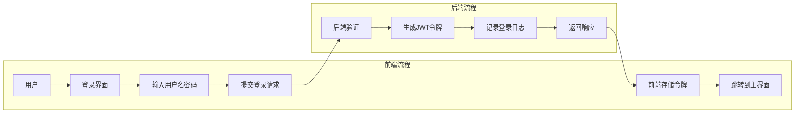
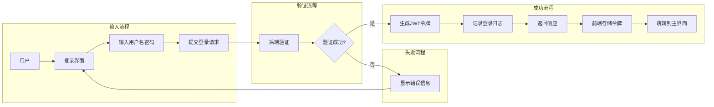
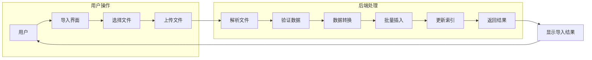
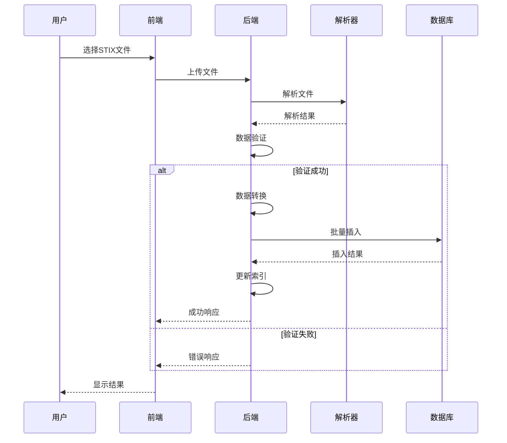
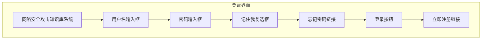
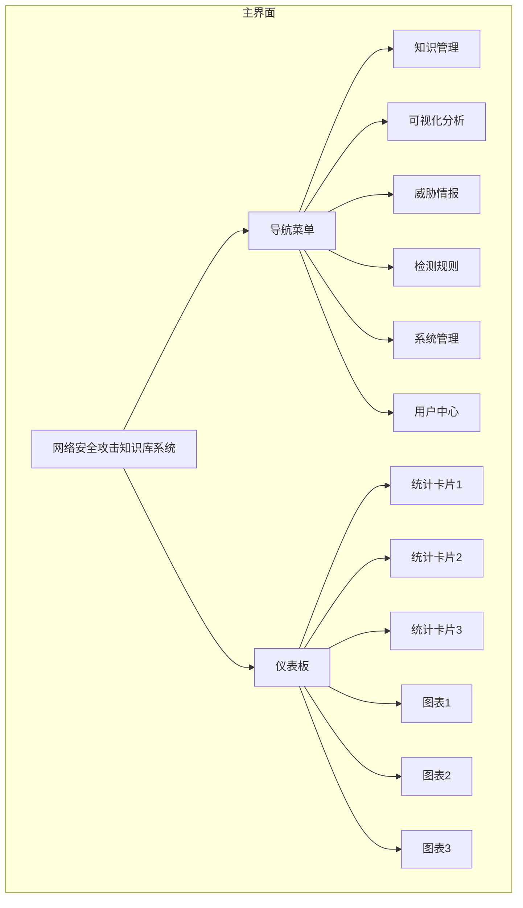

# 网络安全攻击知识库系统 - 详细设计说明书

## 文档信息

| 项目 | 内容 |
|------|------|
| 文档名称 | 详细设计说明书 |
| 版本号 | V1.0 |
| 编制日期 | 2026-03-05 |
| 编制人 | 系统开发团队 |

---

## 1. 引言

### 1.1 编写目的

本文档在概要设计的基础上，对网络安全攻击知识库系统的各模块进行详细设计，包括模块详细说明、类/函数设计、流程设计、数据库详细设计、接口详细设计、数据结构设计、错误处理和测试要点等内容，为开发实施提供具体指导。

### 1.2 设计依据

- 《网络安全攻击知识库系统 - 概要设计说明书》（V1.0）
- MITRE ATT&CK Framework v14.0 规范
- 系统需求规格说明书
- 相关技术文档和标准

### 1.3 设计范围

本文档涵盖系统所有功能模块的详细设计，包括：
- 认证授权模块
- 知识管理模块
- 可视化模块
- 威胁情报模块
- 检测规则模块
- 审计日志模块

### 1.4 修改记录

| 版本 | 修改日期 | 修改人 | 修改内容 |
|------|----------|--------|----------|
| V1.0 | 2026-03-05 | 系统开发团队 | 初始版本 |

---

## 2. 模块详细说明

### 2.1 认证授权模块

#### 2.1.1 模块功能

提供用户身份认证和基于角色的访问控制功能，包括：
- 用户登录、注册、注销
- JWT令牌管理（生成、刷新、验证）
- 角色权限管理
- 访问控制检查

#### 2.1.2 输入/输出参数

| 功能 | 输入参数 | 输出参数 |
|------|----------|----------|
| 用户登录 | `username: string`, `password: string` | `access_token: string`, `refresh_token: string`, `user: object` |
| 令牌刷新 | `refresh_token: string` | `access_token: string` |
| 权限验证 | `token: string`, `resource: string`, `action: string` | `boolean` |
| 用户管理 | `user_data: object` | `success/failure` |
| 角色管理 | `role_data: object` | `success/failure` |

#### 2.1.3 调用关系

```
前端组件 → API接口 → 认证授权模块 → 数据访问层 → 数据库
```

#### 2.1.4 依赖模块

- `Flask-JWT-Extended`：JWT令牌管理
- `werkzeug.security`：密码加密
- `数据访问层`：用户数据操作

#### 2.1.5 业务规则

1. **密码规则**：至少8位，包含大小写字母和数字
2. **会话管理**：
   - 访问令牌有效期：2小时
   - 刷新令牌有效期：7天
   - 令牌过期后需重新登录或刷新
3. **权限继承**：超级管理员拥有所有权限
4. **默认权限**：未明确授权的访问默认拒绝

#### 2.1.6 处理逻辑

**用户登录流程**：
1. **验证用户名密码**：系统首先根据用户输入的用户名查询数据库，确认用户是否存在。如果用户不存在，返回"用户不存在"错误；如果用户存在，使用bcrypt算法验证密码是否正确。
2. **生成JWT令牌**：验证成功后，系统使用JWT库生成访问令牌（access_token）和刷新令牌（refresh_token）。访问令牌有效期为2小时，刷新令牌有效期为7天。
3. **记录登录日志**：系统记录用户的登录时间、登录IP等信息，用于审计和安全分析。
4. **返回令牌和用户信息**：系统将生成的令牌和用户基本信息返回给前端，前端存储令牌用于后续请求的认证。

**权限验证流程**：
1. **解析JWT令牌**：系统从请求头中获取JWT令牌，并使用密钥解析令牌内容，提取用户ID和其他声明信息。
2. **验证令牌有效性**：系统检查令牌是否过期、是否被篡改、是否在黑名单中（如用户已登出）。
3. **获取用户角色权限**：根据解析出的用户ID，系统查询用户所属的角色及其对应的权限。
4. **检查资源访问权限**：系统检查用户是否拥有访问请求资源的权限，权限检查基于资源名称和操作类型。
5. **返回权限检查结果**：如果用户拥有相应权限，允许访问；否则，返回"无权限访问"错误。

---

### 2.2 知识管理模块

#### 2.2.1 模块功能

管理MITRE ATT&CK框架的战术、技术、子技术、缓解措施等核心数据，包括：
- 数据的增删改查操作
- 全文搜索功能
- 数据导入导出
- 数据关联关系管理

#### 2.2.2 输入/输出参数

| 功能 | 输入参数 | 输出参数 |
|------|----------|----------|
| 战术查询 | `domain: string`, `page: int`, `per_page: int` | `tactic_list: array`, `total: int` |
| 技术查询 | `filters: object`, `page: int`, `per_page: int` | `technique_list: array`, `total: int` |
| 子技术查询 | `technique_id: string` | `subtechnique_list: array` |
| 缓解措施查询 | `filters: object` | `mitigation_list: array` |
| 全文搜索 | `keyword: string`, `page: int`, `per_page: int` | `search_results: array`, `total: int` |
| 数据导入 | `stix_file: file` | `import_result: object` |
| 数据导出 | `filters: object`, `format: string` | `export_file: file` |

#### 2.2.3 调用关系

```
前端组件 → API接口 → 知识管理模块 → 数据访问层 → 数据库
```

#### 2.2.4 依赖模块

- `STIX解析库`：解析MITRE官方STIX格式数据
- `全文搜索引擎`：提供搜索功能
- `数据访问层`：ATT&CK数据操作

#### 2.2.5 业务规则

1. **数据完整性**：
   - 战术数据必须包含ID、名称、描述
   - 技术数据必须关联至少一个战术
   - 子技术必须关联父技术
2. **导入规则**：
   - 支持MITRE官方STIX格式数据
   - 重复数据自动更新
   - 导入过程记录详细日志
3. **搜索规则**：
   - 支持关键词搜索
   - 支持按字段筛选
   - 搜索结果按相关性排序

#### 2.2.6 处理逻辑

**数据导入流程**：
1. **上传STIX文件**：用户通过前端界面选择并上传MITRE官方的STIX格式数据文件。系统支持JSON格式的STIX数据文件。
2. **解析STIX数据结构**：系统使用STIX解析库解析上传的文件，提取战术、技术、子技术、缓解措施等核心数据。
3. **验证数据完整性**：系统验证解析后的数据是否完整，包括必填字段检查、数据格式验证等。
4. **转换为数据库模型**：系统将解析后的STIX数据转换为系统内部的数据库模型，确保数据结构符合系统设计。
5. **批量插入数据库**：系统使用批量插入技术将转换后的数据高效插入数据库，减少数据库操作次数。
6. **更新索引和缓存**：数据插入完成后，系统更新相关索引和缓存，确保后续查询性能。

**搜索流程**：
1. **解析搜索关键词和筛选条件**：系统解析用户输入的搜索关键词和各种筛选条件，如领域、平台、战术等。
2. **构建搜索查询**：根据解析后的条件，系统构建优化的数据库查询语句，确保查询效率。
3. **执行数据库查询**：系统执行构建好的查询语句，从数据库中检索符合条件的数据。
4. **处理搜索结果**：系统对查询结果进行处理，包括排序、去重、关联数据补充等。
5. **返回分页结果**：系统将处理后的结果按照分页参数返回给前端，支持前端的分页显示。

---

### 2.3 可视化模块

#### 2.3.1 模块功能

提供攻击矩阵、图谱、路径分析等可视化数据生成和展示功能，包括：
- ATT&CK矩阵可视化
- 力导向图展示
- 攻击路径分析
- 关联关系分析

#### 2.3.2 输入/输出参数

| 功能 | 输入参数 | 输出参数 |
|------|----------|----------|
| 攻击矩阵 | `domain: string`, `filters: object` | `matrix_data: object` |
| 攻击图谱 | `filters: object` | `graph_data: object` |
| 攻击路径 | `source: string`, `target: string` | `path_data: object` |
| 关联分析 | `entity_id: string` | `relation_data: object` |

#### 2.3.3 调用关系

```
前端组件 → API接口 → 可视化模块 → 知识管理模块 → 数据访问层
```

#### 2.3.4 依赖模块

- `ECharts`：图表库
- `NetworkX`：图算法库
- `知识管理模块`：提供基础数据

#### 2.3.5 业务规则

1. **图谱布局规则**：
   - 战术节点：按固定位置排列
   - 技术节点：围绕战术节点分布
   - 边类型：表示技术间的关系
2. **路径分析规则**：
   - 支持多路径搜索
   - 路径长度限制：最多5步
   - 路径权重：基于技术使用频率

#### 2.3.6 处理逻辑

**攻击路径分析流程**：
1. **接收起点和终点节点**：系统接收用户指定的起点和终点节点，可以是战术、技术或子技术。
2. **构建攻击知识图谱**：系统从数据库中加载相关的攻击知识数据，构建完整的攻击知识图谱，包括节点和边的关系。
3. **使用BFS算法搜索所有可能路径**：系统使用广度优先搜索（BFS）算法从起点节点开始，搜索到终点节点的所有可能路径。
4. **筛选符合条件的路径**：系统根据用户指定的条件（如路径长度限制、技术类型等）筛选出符合要求的路径。
5. **计算路径权重**：系统根据技术的使用频率、严重程度等因素计算每条路径的权重，用于排序和优先级显示。
6. **返回路径数据**：系统将处理后的路径数据返回给前端，包括节点信息、边信息和路径权重等。

**关联分析流程**：
1. **接收实体ID**：系统接收用户指定的实体ID，可以是威胁行为者、技术或软件。
2. **查询直接关联实体**：系统查询与指定实体直接关联的其他实体，如威胁行为者使用的技术、技术对应的缓解措施等。
3. **计算关联强度**：系统根据共同邻居数、关联频率等因素计算实体间的关联强度。
4. **构建关联关系图**：系统根据查询结果和计算的关联强度，构建完整的关联关系图。
5. **返回可视化数据**：系统将构建好的关联关系图数据返回给前端，用于可视化展示。

---

## 3. 类/函数/接口详细设计

### 3.1 认证授权模块类设计

#### 3.1.1 AuthService类

**功能说明**：AuthService类是认证授权模块的核心服务类，负责处理用户登录、令牌管理和权限验证等功能。该类采用依赖注入模式，通过构造函数注入AuthRepository和JWTManager依赖。

**核心属性**：
- `__auth_repository`：用户数据访问层，负责用户信息的存储和查询
- `__jwt_manager`：JWT令牌管理器，负责令牌的生成、验证和刷新

**主要方法**：

1. **login(username, password)**：用户登录方法
   - **参数**：
     - `username`：用户输入的用户名
     - `password`：用户输入的密码
   - **返回值**：TokenResponse对象，包含访问令牌、刷新令牌和用户信息
   - **处理逻辑**：
     - 查询用户是否存在
     - 验证密码是否正确
     - 生成JWT令牌
     - 记录登录日志
     - 返回令牌和用户信息

2. **refresh_token(refresh_token)**：刷新访问令牌方法
   - **参数**：
     - `refresh_token`：用户的刷新令牌
   - **返回值**：新的访问令牌
   - **处理逻辑**：
     - 验证刷新令牌的有效性
     - 生成新的访问令牌

3. **verify_permission(token, resource, action)**：验证用户权限方法
   - **参数**：
     - `token`：用户的JWT令牌
     - `resource`：请求的资源名称
     - `action`：请求的操作类型
   - **返回值**：布尔值，表示用户是否拥有权限
   - **处理逻辑**：
     - 解析JWT令牌获取用户ID
     - 查询用户信息
     - 检查用户是否为超级管理员
     - 检查用户角色是否拥有相应权限

**私有方法**：
- `__verify_password(password, password_hash)`：验证密码方法，使用bcrypt算法验证密码
- `__has_permission(role, resource, action)`：检查角色是否拥有指定权限的方法

```python
class AuthService:
    """认证服务类"""
    
    # 属性
    __auth_repository: AuthRepository
    __jwt_manager: JWTManager
    
    # 构造函数
    def __init__(self, auth_repository: AuthRepository, jwt_manager: JWTManager):
        self.__auth_repository = auth_repository
        self.__jwt_manager = jwt_manager
    
    # 方法
    def login(self, username: str, password: str) -> TokenResponse:
        """
        用户登录
        参数:
            username: 用户名
            password: 密码
        返回:
            TokenResponse: 包含访问令牌和刷新令牌的响应对象
        """
        # 1. 查询用户
        user = self.__auth_repository.find_by_username(username)
        if not user:
            raise AuthenticationError("用户不存在")
        
        # 2. 验证密码
        if not self.__verify_password(password, user.password_hash):
            raise AuthenticationError("密码错误")
        
        # 3. 生成令牌
        access_token, refresh_token = self.__jwt_manager.generate_tokens(user.id)
        
        # 4. 记录登录日志
        self.__auth_repository.record_login(user.id)
        
        # 5. 返回响应
        return TokenResponse(access_token, refresh_token, user.to_dict())
    
    def refresh_token(self, refresh_token: str) -> str:
        """
        刷新访问令牌
        参数:
            refresh_token: 刷新令牌
        返回:
            str: 新的访问令牌
        """
        user_id = self.__jwt_manager.verify_refresh_token(refresh_token)
        return self.__jwt_manager.generate_access_token(user_id)
    
    def verify_permission(self, token: str, resource: str, action: str) -> bool:
        """
        验证用户权限
        参数:
            token: JWT令牌
            resource: 资源名称
            action: 操作类型
        返回:
            bool: 权限检查结果
        """
        user_id = self.__jwt_manager.get_user_id(token)
        user = self.__auth_repository.find_by_id(user_id)
        
        # 超级管理员拥有所有权限
        if user.is_superadmin:
            return True
        
        # 检查角色权限
        for role in user.roles:
            if self.__has_permission(role, resource, action):
                return True
        
        return False
    
    # 私有方法
    def __verify_password(self, password: str, password_hash: str) -> bool:
        """验证密码"""
        return check_password_hash(password_hash, password)
    
    def __has_permission(self, role: Role, resource: str, action: str) -> bool:
        """检查角色是否有指定权限"""
        for permission in role.permissions:
            if permission.resource == resource and permission.action == action:
                return True
            if permission.resource == '*' and permission.action == '*':
                return True
        return False
```

#### 3.1.2 TokenResponse类

```python
class TokenResponse:
    """令牌响应类"""
    
    # 属性
    access_token: str
    refresh_token: str
    user: dict
    
    # 构造函数
    def __init__(self, access_token: str, refresh_token: str, user: dict):
        self.access_token = access_token
        self.refresh_token = refresh_token
        self.user = user
```

---

### 3.2 知识管理模块类设计

#### 3.2.1 KnowledgeService类

**功能说明**：KnowledgeService类是知识管理模块的核心服务类，负责处理MITRE ATT&CK框架数据的管理、查询、导入和导出等功能。该类采用依赖注入模式，通过构造函数注入KnowledgeRepository和SearchService依赖。

**核心属性**：
- `__knowledge_repository`：知识数据访问层，负责ATT&CK数据的存储和查询
- `__search_service`：搜索服务，负责提供全文搜索功能

**主要方法**：

1. **get_tactics(domain, page, per_page)**：获取战术列表方法
   - **参数**：
     - `domain`：领域（enterprise/mobile/ics），可选
     - `page`：页码，默认1
     - `per_page`：每页数量，默认20
   - **返回值**：PaginatedResult对象，包含战术列表和分页信息
   - **处理逻辑**：
     - 根据领域筛选战术
     - 对结果进行分页处理

2. **get_techniques(filters, page, per_page)**：获取技术列表方法
   - **参数**：
     - `filters`：筛选条件，可选
     - `page`：页码，默认1
     - `per_page`：每页数量，默认20
   - **返回值**：PaginatedResult对象，包含技术列表和分页信息
   - **处理逻辑**：
     - 根据筛选条件查询技术
     - 对结果进行分页处理

3. **search(keyword, domain, page, per_page)**：全文搜索方法
   - **参数**：
     - `keyword`：搜索关键词
     - `domain`：领域，可选
     - `page`：页码，默认1
     - `per_page`：每页数量，默认20
   - **返回值**：PaginatedResult对象，包含搜索结果和分页信息
   - **处理逻辑**：
     - 调用搜索服务执行全文搜索
     - 返回搜索结果

4. **import_stix_data(stix_file)**：导入STIX数据方法
   - **参数**：
     - `stix_file`：STIX文件路径
   - **返回值**：ImportResult对象，包含导入结果信息
   - **处理逻辑**：
     - 解析STIX文件
     - 验证数据完整性
     - 导入数据到数据库
     - 返回导入结果

5. **export_data(filters, format)**：导出数据方法
   - **参数**：
     - `filters`：筛选条件，可选
     - `format`：导出格式（json/csv），默认json
   - **返回值**：导出文件路径
   - **处理逻辑**：
     - 根据筛选条件查询数据
     - 按照指定格式导出数据
     - 返回导出文件路径

**私有方法**：
- `__paginate(query, page, per_page)`：分页查询方法，用于处理查询结果的分页

```python
class KnowledgeService:
    """知识管理服务类"""
    
    # 属性
    __knowledge_repository: KnowledgeRepository
    __search_service: SearchService
    
    # 构造函数
    def __init__(self, knowledge_repository: KnowledgeRepository, search_service: SearchService):
        self.__knowledge_repository = knowledge_repository
        self.__search_service = search_service
    
    # 方法
    def get_tactics(self, domain: str = None, page: int = 1, per_page: int = 20) -> PaginatedResult:
        """
        获取战术列表
        参数:
            domain: 领域（enterprise/mobile/ics）
            page: 页码
            per_page: 每页数量
        返回:
            PaginatedResult: 分页结果
        """
        tactics = self.__knowledge_repository.find_tactics(domain)
        return self.__paginate(tactics, page, per_page)
    
    def get_techniques(self, filters: dict = None, page: int = 1, per_page: int = 20) -> PaginatedResult:
        """
        获取技术列表
        参数:
            filters: 筛选条件
            page: 页码
            per_page: 每页数量
        返回:
            PaginatedResult: 分页结果
        """
        techniques = self.__knowledge_repository.find_techniques(filters)
        return self.__paginate(techniques, page, per_page)
    
    def search(self, keyword: str, domain: str = None, page: int = 1, per_page: int = 20) -> PaginatedResult:
        """
        全文搜索
        参数:
            keyword: 搜索关键词
            domain: 领域
            page: 页码
            per_page: 每页数量
        返回:
            PaginatedResult: 分页结果
        """
        return self.__search_service.search(keyword, domain, page, per_page)
    
    def import_stix_data(self, stix_file: str) -> ImportResult:
        """
        导入STIX数据
        参数:
            stix_file: STIX文件路径
        返回:
            ImportResult: 导入结果
        """
        # 解析STIX文件
        stix_parser = StixParser(stix_file)
        stix_data = stix_parser.parse()
        
        # 验证数据
        validator = StixValidator(stix_data)
        if not validator.validate():
            raise DataValidationError("数据验证失败")
        
        # 导入数据
        result = self.__knowledge_repository.import_data(stix_data)
        return ImportResult(
            success=result['success'],
            total=result['total'],
            imported=result['imported'],
            errors=result['errors']
        )
    
    def export_data(self, filters: dict = None, format: str = 'json') -> str:
        """
        导出数据
        参数:
            filters: 筛选条件
            format: 导出格式（json/csv）
        返回:
            str: 导出文件路径
        """
        data = self.__knowledge_repository.find_by_filters(filters)
        return self.__export_formatter.export(data, format)
    
    # 私有方法
    def __paginate(self, query, page: int, per_page: int) -> PaginatedResult:
        """分页查询"""
        offset = (page - 1) * per_page
        total = query.count()
        items = query.offset(offset).limit(per_page).all()
        pages = (total + per_page - 1) // per_page
        
        return PaginatedResult(
            items=items,
            total=total,
            page=page,
            per_page=per_page,
            pages=pages
        )
```

#### 3.2.2 PaginatedResult类

```python
class PaginatedResult:
    """分页结果类"""
    
    # 属性
    items: list
    total: int
    page: int
    per_page: int
    pages: int
    
    # 构造函数
    def __init__(self, items: list, total: int, page: int, per_page: int, pages: int):
        self.items = items
        self.total = total
        self.page = page
        self.per_page = per_page
        self.pages = pages
    
    # 方法
    def to_dict(self) -> dict:
        """转换为字典"""
        return {
            'items': [item.to_dict() for item in self.items],
            'total': self.total,
            'page': self.page,
            'per_page': self.per_page,
            'pages': self.pages
        }
```

---

## 4. 流程详细设计

### 4.1 用户登录流程

**流程说明**：用户登录流程描述了用户从访问登录界面到成功登录系统的完整过程，包括身份验证、令牌生成和会话管理等步骤。

**流程步骤**：
1. **用户访问登录界面**：用户打开系统登录页面
2. **输入用户名密码**：用户在登录表单中输入用户名和密码
3. **提交登录请求**：用户点击登录按钮，前端向后端发送登录请求
4. **后端验证**：后端验证用户名和密码的正确性
5. **生成JWT令牌**：验证成功后，后端生成访问令牌和刷新令牌
6. **记录登录日志**：系统记录用户的登录时间和IP地址
7. **返回响应**：后端将令牌和用户信息返回给前端
8. **前端存储令牌**：前端将令牌存储在本地存储中
9. **跳转到主界面**：用户成功登录后，系统跳转到主界面



#### 4.1.1 业务流程图

**流程说明**：业务流程图详细描述了用户登录过程中的决策分支，包括验证成功和验证失败的处理流程。

**流程步骤**：
1. **用户访问登录界面**：用户打开系统登录页面
2. **输入用户名密码**：用户在登录表单中输入用户名和密码
3. **提交登录请求**：用户点击登录按钮，前端向后端发送登录请求
4. **后端验证**：后端验证用户名和密码的正确性
5. **验证判断**：系统判断验证是否成功
   - **验证成功**：生成JWT令牌 → 记录登录日志 → 返回响应 → 前端存储令牌 → 跳转到主界面
   - **验证失败**：显示错误信息 → 返回登录界面



#### 4.1.2 异常处理流程

**流程说明**：异常处理流程描述了用户登录过程中可能遇到的各种异常情况及其处理方式。

**异常类型及处理**：
1. **密码错误**：当用户输入的密码与数据库中存储的密码哈希不匹配时，系统显示"用户名或密码错误"提示
2. **用户不存在**：当用户输入的用户名在数据库中不存在时，系统显示"用户不存在"提示
3. **系统错误**：当后端服务出现异常时，系统显示"系统忙，请稍后重试"提示

```mermaid
graph LR
    A[登录异常] --> B[密码错误]
    A --> C[用户不存在]
    A --> D[系统错误]
    B --> E[显示"用户名或密码错误"]
    C --> F[显示"用户不存在"]
    D --> G[显示"系统忙，请稍后重试"]
    E --> H[返回登录界面]
    F --> H
    G --> H
```

---

### 4.2 数据导入流程

**流程说明**：数据导入流程描述了从用户选择STIX文件到数据成功导入系统的完整过程，包括文件上传、解析、验证、转换和存储等步骤。

**流程步骤**：
1. **用户访问导入界面**：用户打开系统的数据导入页面
2. **选择文件**：用户选择要导入的MITRE STIX格式数据文件
3. **上传文件**：用户点击上传按钮，将文件上传到后端服务器
4. **解析文件**：后端使用STIX解析器解析上传的文件，提取战术、技术、子技术等数据
5. **验证数据**：系统验证解析后的数据是否完整和有效
6. **数据转换**：系统将解析后的数据转换为数据库模型
7. **批量插入**：系统使用批量插入技术将转换后的数据高效插入数据库
8. **更新索引**：数据插入完成后，系统更新相关索引和缓存
9. **返回结果**：系统将导入结果返回给前端，显示导入成功或失败信息



#### 4.2.1 时序图

**流程说明**：时序图详细描述了数据导入过程中各个系统组件之间的交互顺序和消息传递，包括用户、前端、后端、解析器和数据库之间的协作。

**交互步骤**：
1. **用户选择文件**：用户在前端界面选择要导入的STIX文件
2. **前端上传文件**：前端将选择的文件上传到后端服务器
3. **后端解析文件**：后端将文件传递给STIX解析器进行解析
4. **解析器返回结果**：解析器解析完成后，将解析结果返回给后端
5. **后端验证数据**：后端验证解析后的数据是否完整和有效
6. **数据处理分支**：
   - **验证成功**：后端进行数据转换 → 批量插入数据库 → 更新索引 → 返回成功响应
   - **验证失败**：后端直接返回错误响应
7. **前端显示结果**：前端接收到后端响应后，将导入结果显示给用户



---

## 5. 数据库详细设计

### 5.1 表结构设计

#### 5.1.1 用户表 (users)

**用途**：存储系统用户信息，包括登录凭证、角色关联和登录历史等。

**字段说明**：
| 字段名 | 类型 | 长度 | 主键 | 外键 | 索引 | 字段含义 | 约束 | 默认值 |
|--------|------|------|------|------|------|----------|------|--------|
| id | INTEGER | - | 是 | - | - | 用户ID | 自增 | - |
| username | VARCHAR | 80 | - | - | 是 | 用户名 | 唯一、必填 | - |
| password_hash | VARCHAR | 255 | - | - | - | 密码哈希 | 必填 | - |
| email | VARCHAR | 120 | - | - | 是 | 邮箱 | 唯一、必填 | - |
| role_id | INTEGER | - | - | 是 | 是 | 角色ID | - | 1 |
| is_active | BOOLEAN | - | - | - | - | 是否激活 | - | True |
| last_login | TIMESTAMP | - | - | - | - | 最后登录时间 | - | - |
| login_count | INTEGER | - | - | - | - | 登录次数 | - | 0 |
| created_at | TIMESTAMP | - | - | - | - | 创建时间 | - | CURRENT_TIMESTAMP |
| updated_at | TIMESTAMP | - | - | - | - | 更新时间 | - | CURRENT_TIMESTAMP |

**设计说明**：
- `username`和`email`字段设置唯一索引，确保用户标识的唯一性
- `password_hash`字段存储使用bcrypt算法加密后的密码，不存储明文密码
- `role_id`字段关联到角色表，实现基于角色的权限控制
- `is_active`字段用于控制用户账号的激活状态
- `last_login`和`login_count`字段用于记录用户登录历史，便于审计和安全分析
- `created_at`和`updated_at`字段用于记录数据的创建和更新时间

#### 5.1.2 角色表 (roles)

**用途**：存储系统角色信息，包括角色名称、描述和权限列表等。

**字段说明**：
| 字段名 | 类型 | 长度 | 主键 | 外键 | 索引 | 字段含义 | 约束 | 默认值 |
|--------|------|------|------|------|------|----------|------|--------|
| id | INTEGER | - | 是 | - | - | 角色ID | 自增 | - |
| name | VARCHAR | 80 | - | - | - | 角色名称 | 唯一、必填 | - |
| description | TEXT | - | - | - | - | 角色描述 | - | - |
| permissions | TEXT | - | - | - | - | 权限列表 | - | - |
| created_at | TIMESTAMP | - | - | - | - | 创建时间 | - | CURRENT_TIMESTAMP |
| updated_at | TIMESTAMP | - | - | - | - | 更新时间 | - | CURRENT_TIMESTAMP |

**设计说明**：
- `name`字段设置唯一约束，确保角色名称的唯一性
- `permissions`字段存储角色的权限列表，采用JSON格式存储，便于扩展和管理
- 角色表与用户表通过`role_id`外键关联，实现基于角色的权限控制
- 系统默认包含超级管理员、管理员、普通用户和访客等基础角色

#### 5.1.3 战术表 (tactics)

**用途**：存储MITRE ATT&CK框架的战术信息，包括战术ID、名称、描述和领域等。

**字段说明**：
| 字段名 | 类型 | 长度 | 主键 | 外键 | 索引 | 字段含义 | 约束 | 默认值 |
|--------|------|------|------|------|------|----------|------|--------|
| id | INTEGER | - | 是 | - | - | 战术ID | 自增 | - |
| tactic_id | VARCHAR | 20 | - | - | 是 | ATT&CK战术ID | 唯一、必填 | - |
| name | VARCHAR | 200 | - | - | - | 战术名称 | 必填 | - |
| description | TEXT | - | - | - | - | 战术描述 | - | - |
| domain | VARCHAR | 20 | - | - | 是 | 领域 | 必填 | enterprise |
| order | INTEGER | - | - | - | - | 显示顺序 | - | 0 |
| url | VARCHAR | 500 | - | - | - | 官方链接 | - | - |
| created_at | TIMESTAMP | - | - | - | - | 创建时间 | - | CURRENT_TIMESTAMP |
| updated_at | TIMESTAMP | - | - | - | - | 更新时间 | - | CURRENT_TIMESTAMP |

**设计说明**：
- `tactic_id`字段存储MITRE ATT&CK官方的战术ID（如TA0001），设置唯一约束确保数据一致性
- `domain`字段用于区分不同领域的战术，如enterprise（企业）、mobile（移动）和ics（工业控制系统）
- `order`字段用于控制战术的显示顺序，确保在矩阵和列表中按照MITRE ATT&CK官方顺序显示
- `url`字段存储MITRE ATT&CK官方网站上该战术的链接，便于用户参考原始资料

#### 5.1.4 技术表 (techniques)

**用途**：存储MITRE ATT&CK框架的技术和子技术信息，包括技术ID、名称、描述、所属战术和支持平台等。

**字段说明**：
| 字段名 | 类型 | 长度 | 主键 | 外键 | 索引 | 字段含义 | 约束 | 默认值 |
|--------|------|------|------|------|------|----------|------|--------|
| id | INTEGER | - | 是 | - | - | 技术ID | 自增 | - |
| technique_id | VARCHAR | 20 | - | - | 是 | ATT&CK技术ID | 唯一、必填 | - |
| name | VARCHAR | 200 | - | - | - | 技术名称 | 必填 | - |
| description | TEXT | - | - | - | - | 技术描述 | - | - |
| tactic_id | VARCHAR | 20 | - | 是 | 是 | 所属战术ID | - | - |
| domain | VARCHAR | 20 | - | - | 是 | 领域 | 必填 | enterprise |
| platforms | TEXT | - | - | - | - | 支持平台 | - | - |
| is_subtechnique | BOOLEAN | - | - | - | 是 | 是否子技术 | - | False |
| parent_technique_id | VARCHAR | 20 | - | 是 | - | 父技术ID | - | - |
| url | VARCHAR | 500 | - | - | - | 官方链接 | - | - |
| created_at | TIMESTAMP | - | - | - | - | 创建时间 | - | CURRENT_TIMESTAMP |
| updated_at | TIMESTAMP | - | - | - | - | 更新时间 | - | CURRENT_TIMESTAMP |

**设计说明**：
- `technique_id`字段存储MITRE ATT&CK官方的技术ID（如T1566），设置唯一约束确保数据一致性
- `tactic_id`字段关联到战术表，标识技术所属的战术
- `is_subtechnique`字段用于区分技术和子技术，子技术是技术的细分变体
- `parent_technique_id`字段用于子技术关联到父技术，实现技术体系的层级结构
- `platforms`字段存储技术支持的平台列表，采用JSON格式存储，如["Windows", "Linux", "macOS"]
- `domain`字段用于区分不同领域的技术，与战术表的domain字段对应

---

### 5.2 视图设计

#### 5.2.1 用户权限视图 (v_user_permissions)

**用途**：查询用户的完整权限信息，包括用户基本信息、所属角色和拥有的权限，便于权限验证和管理。

**设计说明**：
- 该视图通过多表关联，将用户、角色和权限信息整合到一个视图中，简化权限查询操作
- 关联了users、user_roles、roles、role_permissions和permissions五个表
- 提供了用户ID、用户名、邮箱、角色ID、角色名称、资源和操作等字段

**使用场景**：
- 权限验证时快速查询用户的所有权限
- 管理员查看用户权限分配情况
- 权限审计和权限分析

**SQL定义**：
```sql
CREATE VIEW v_user_permissions AS
SELECT 
    u.id AS user_id,
    u.username,
    u.email,
    r.id AS role_id,
    r.name AS role_name,
    p.resource,
    p.action
FROM 
    users u
JOIN 
    user_roles ur ON u.id = ur.user_id
JOIN 
    roles r ON ur.role_id = r.id
JOIN 
    role_permissions rp ON r.id = rp.role_id
JOIN 
    permissions p ON rp.permission_id = p.id;
```

#### 5.2.2 技术统计视图 (v_technique_stats)

**用途**：统计各战术下的技术数量、子技术数量和相关缓解措施数量，为系统仪表板和管理界面提供统计数据。

**设计说明**：
- 该视图通过左连接关联tactics、techniques和technique_mitigations三个表
- 统计每个战术下的技术总数、子技术数量和相关缓解措施数量
- 使用GROUP BY子句按战术ID和名称分组，确保每个战术只返回一条统计记录

**使用场景**：
- 系统仪表板展示各战术的技术分布情况
- 管理员分析ATT&CK框架数据的覆盖情况
- 安全团队了解各战术的复杂度和缓解难度

**SQL定义**：
```sql
CREATE VIEW v_technique_stats AS
SELECT 
    t.tactic_id,
    t.name AS tactic_name,
    COUNT(tc.id) AS technique_count,
    COUNT(CASE WHEN tc.is_subtechnique = 1 THEN 1 END) AS subtechnique_count,
    COUNT(DISTINCT tm.mitigation_id) AS mitigation_count
FROM 
    tactics t
LEFT JOIN 
    techniques tc ON t.tactic_id = tc.tactic_id
LEFT JOIN 
    technique_mitigations tm ON tc.technique_id = tm.technique_id
GROUP BY 
    t.tactic_id, t.name;
```

---

### 5.3 触发器设计

#### 5.3.1 用户更新触发器

**用途**：自动更新用户表的updated_at字段，确保用户数据的更新时间戳始终保持最新。

**设计说明**：
- 该触发器在users表发生UPDATE操作后执行
- 使用OLD.id获取被更新记录的ID
- 将对应记录的updated_at字段设置为当前时间戳
- 确保每次用户信息变更都能被正确记录时间

**使用场景**：
- 用户资料修改时自动更新时间戳
- 密码修改时记录更新时间
- 角色变更时记录更新时间

**SQL定义**：
```sql
CREATE TRIGGER trigger_update_user
AFTER UPDATE ON users
BEGIN
    UPDATE users 
    SET updated_at = CURRENT_TIMESTAMP
    WHERE id = OLD.id;
END;
```

#### 5.3.2 审计日志触发器

**用途**：自动记录用户操作日志，包括用户的创建、更新和删除操作，为系统提供完整的审计追踪能力。

**设计说明**：
- 该触发器在users表发生INSERT、UPDATE或DELETE操作后执行
- 根据操作类型（插入、更新、删除）自动记录不同的操作类型
- 使用CASE语句处理不同操作类型下的字段取值
- 记录操作的用户ID、用户名、操作类型、资源类型、资源ID和详细信息
- 使用JSON_OBJECT函数格式化详细信息，便于后续查询和分析

**使用场景**：
- 安全审计：追踪用户账户的创建、修改和删除操作
- 问题排查：当用户账户出现问题时，通过审计日志追溯操作历史
- 合规要求：满足安全合规要求，提供操作审计记录

**SQL定义**：
```sql
CREATE TRIGGER trigger_user_audit
AFTER INSERT OR UPDATE OR DELETE ON users
BEGIN
    INSERT INTO audit_logs (
        user_id,
        username,
        action,
        resource,
        resource_id,
        details
    ) VALUES (
        CASE 
            WHEN OLD.id IS NOT NULL THEN OLD.id
            ELSE NEW.id 
        END,
        CASE 
            WHEN OLD.username IS NOT NULL THEN OLD.username
            ELSE NEW.username 
        END,
        CASE 
            WHEN NEW.id IS NULL THEN 'delete'
            WHEN OLD.id IS NULL THEN 'create'
            ELSE 'update' 
        END,
        'user',
        CASE 
            WHEN OLD.id IS NOT NULL THEN OLD.id
            ELSE NEW.id 
        END,
        CASE 
            WHEN NEW.id IS NULL THEN JSON_OBJECT('deleted_user', OLD.username)
            WHEN OLD.id IS NULL THEN JSON_OBJECT('created_user', NEW.username)
            ELSE JSON_OBJECT('old_user', OLD.username, 'new_user', NEW.username) 
        END
    );
END;
```

---

## 6. 界面详细设计

### 6.1 登录界面

#### 6.1.1 界面布局



#### 6.1.2 控件说明

| 控件名 | 类型 | 属性 | 说明 |
|--------|------|------|------|
| 用户名输入框 | input | type: text, placeholder: "请输入用户名" | 用户输入用户名 |
| 密码输入框 | input | type: password, placeholder: "请输入密码" | 用户输入密码 |
| 记住我 | checkbox | name: remember | 是否记住登录状态 |
| 忘记密码 | link | href: /auth/forgot | 跳转到找回密码页面 |
| 登录按钮 | button | type: submit, disabled: {{loading}} | 提交登录请求 |
| 立即注册 | link | href: /auth/register | 跳转到注册页面 |

#### 6.1.3 交互逻辑

```
1. 输入用户名密码后点击登录
2. 验证输入不为空
3. 显示加载状态
4. 发送登录请求
5. 根据响应显示结果
6. 成功登录后跳转主页面
```

#### 6.1.4 输入校验规则

```javascript
// 用户名校验
if (username.length < 3 || username.length > 20) {
    showError("用户名长度应在3-20个字符之间");
}

// 密码校验
if (password.length < 8) {
    showError("密码至少需要8个字符");
}

// 正则表达式校验
const passwordPattern = /^(?=.*[a-z])(?=.*[A-Z])(?=.*\d).{8,}$/;
if (!passwordPattern.test(password)) {
    showError("密码应包含大小写字母和数字");
}
```

---

### 6.2 主界面

#### 6.2.1 界面布局



#### 6.2.2 主要功能区域

1. **导航菜单**：系统功能模块导航
2. **仪表板**：系统概览和统计信息
3. **快捷操作**：常用功能入口
4. **系统通知**：最新消息和通知

---

## 7. 接口详细设计

### 7.1 认证模块接口

#### 7.1.1 用户登录接口

**URL**：`/api/auth/login`

**方法**：POST

**请求头**：
```json
{
  "Content-Type": "application/json"
}
```

**请求体**：
```json
{
  "username": "admin",
  "password": "admin123"
}
```

**返回码**：200（成功）/ 401（失败）

**返回报文**：
```json
{
  "access_token": "eyJhbGciOiJIUzI1NiIsInR5cCI6IkpXVCJ9...",
  "refresh_token": "eyJhbGciOiJIUzI1NiIsInR5cCI6IkpXVCJ9...",
  "user": {
    "id": 1,
    "username": "admin",
    "email": "admin@attackkg.com",
    "roles": ["admin"],
    "permissions": ["*"]
  }
}
```

**错误码**：
- `AUTH001`：用户名或密码错误
- `AUTH002`：用户已被禁用
- `AUTH003`：系统忙，请稍后重试

---

### 7.2 知识管理模块接口

#### 7.2.1 获取战术列表接口

**URL**：`/api/tactics`

**方法**：GET

**请求头**：
```json
{
  "Content-Type": "application/json"
}
```

**请求参数**：
```
page: 页码（默认1）
per_page: 每页数量（默认20）
search: 搜索关键词
```

**返回码**：200

**返回报文**：
```json
{
  "items": [
    {
      "id": 1,
      "tactic_id": "TA0001",
      "name": "初始访问",
      "description": "攻击者试图进入您的网络。",
      "url": "https://attack.mitre.org/tactics/TA0001",
      "created_at": "2026-03-02T23:57:29.000000",
      "updated_at": "2026-03-02T23:57:29.000000"
    }
  ],
  "total": 14,
  "page": 1,
  "per_page": 20,
  "pages": 1,
  "has_next": false,
  "has_prev": false
}
```

---

### 7.3 可视化模块接口

#### 7.3.1 获取攻击矩阵接口

**URL**：`/api/visualization/attack_matrix`

**方法**：GET

**请求头**：
```json
{
  "Content-Type": "application/json"
}
```

**请求参数**：
```
platform: 平台（可选）
```

**返回码**：200

**返回报文**：
```json
{
  "matrix": [
    {
      "id": 1,
      "tactic_id": "TA0001",
      "name": "初始访问",
      "description": "攻击者试图进入您的网络。",
      "url": "https://attack.mitre.org/tactics/TA0001",
      "created_at": "2026-03-02T23:57:29.000000",
      "updated_at": "2026-03-02T23:57:29.000000",
      "techniques": [
        {
          "id": 1,
          "technique_id": "T1566",
          "name": "钓鱼",
          "description": "...",
          "platforms": ["Windows", "Linux", "macOS"],
          "is_subtechnique": false,
          "url": "https://attack.mitre.org/techniques/T1566"
        }
      ]
    }
  ],
  "total_tactics": 14,
  "total_techniques": 691
}
```

#### 7.3.2 获取攻击路径接口

**URL**：`/api/visualization/attack_paths`

**方法**：GET

**请求头**：
```json
{
  "Content-Type": "application/json"
}
```

**请求参数**：
```
tactic_id: 战术ID（可选）
```

**返回码**：200

**返回报文**：
```json
{
  "nodes": [
    {
      "id": "TA0001",
      "name": "初始访问",
      "type": "tactic",
      "category": "TA0001",
      "value": 14
    },
    {
      "id": "T1566",
      "name": "钓鱼",
      "type": "technique",
      "category": "TA0001",
      "value": 1,
      "is_subtechnique": false
    }
  ],
  "edges": [
    {
      "source": "TA0001",
      "target": "T1566",
      "type": "belongs_to"
    },
    {
      "source": "T1566",
      "target": "T1059",
      "type": "leads_to"
    }
  ],
  "total_nodes": 50,
  "total_edges": 60
}
```

---

## 8. 数据结构设计

### 8.1 常量定义

```python
# JWT配置常量
JWT_CONFIG = {
    'ACCESS_TOKEN_EXPIRES': 2 * 60 * 60,  # 2小时
    'REFRESH_TOKEN_EXPIRES': 7 * 24 * 60 * 60,  # 7天
    'ALGORITHM': 'HS256',
    'SECRET_KEY': 'your-secret-key-here'
}

# 分页配置常量
PAGINATION_CONFIG = {
    'DEFAULT_PER_PAGE': 20,
    'MAX_PER_PAGE': 100,
    'PAGE_RANGE': 5
}

# 文件上传配置
UPLOAD_CONFIG = {
    'MAX_FILE_SIZE': 10 * 1024 * 1024,  # 10MB
    'ALLOWED_EXTENSIONS': {'json', 'zip'},
    'UPLOAD_PATH': '/tmp/uploads'
}

# 搜索配置
SEARCH_CONFIG = {
    'SEARCH_TIMEOUT': 30,
    'SEARCH_LIMIT': 1000,
    'SEARCH_FIELDS': ['name', 'description', 'keywords']
}
```

---

### 8.2 枚举类型

```python
# 权限动作枚举
class PermissionAction:
    READ = 'read'
    CREATE = 'create'
    UPDATE = 'update'
    DELETE = 'delete'
    EXPORT = 'export'
    IMPORT = 'import'
    ALL = '*'

# 角色类型枚举
class RoleType:
    SUPER_ADMIN = 'super_admin'
    ADMIN = 'admin'
    USER = 'user'
    GUEST = 'guest'

# 数据状态枚举
class DataStatus:
    ACTIVE = 'active'
    INACTIVE = 'inactive'
    DEPRECATED = 'deprecated'

# 严重程度枚举
class SeverityLevel:
    LOW = 'low'
    MEDIUM = 'medium'
    HIGH = 'high'
    CRITICAL = 'critical'
```

---

### 8.3 配置项

```python
# 系统配置
SYSTEM_CONFIG = {
    'SITE_NAME': '网络安全攻击知识库系统',
    'SITE_VERSION': '1.0.0',
    'DEBUG': True,
    'ALLOW_REGISTRATION': True,
    'DEFAULT_ROLE': RoleType.USER
}

# 数据库配置
DATABASE_CONFIG = {
    'SQLALCHEMY_DATABASE_URI': 'sqlite:///attackkg.db',
    'SQLALCHEMY_TRACK_MODIFICATIONS': False,
    'SQLALCHEMY_POOL_SIZE': 20,
    'SQLALCHEMY_MAX_OVERFLOW': 30,
    'SQLALCHEMY_POOL_TIMEOUT': 30
}

# 日志配置
LOGGING_CONFIG = {
    'level': 'INFO',
    'file_path': 'logs/attackkg.log',
    'max_bytes': 10 * 1024 * 1024,
    'backup_count': 5,
    'format': '%(asctime)s - %(name)s - %(levelname)s - %(message)s'
}
```

---

## 9. 异常与错误处理

### 9.1 异常类型

```python
class BaseError(Exception):
    """基础异常类"""
    def __init__(self, message, error_code=500):
        self.message = message
        self.error_code = error_code

class AuthenticationError(BaseError):
    """认证异常"""
    def __init__(self, message):
        super().__init__(message, 401)

class AuthorizationError(BaseError):
    """授权异常"""
    def __init__(self, message):
        super().__init__(message, 403)

class ValidationError(BaseError):
    """数据验证异常"""
    def __init__(self, message):
        super().__init__(message, 400)

class NotFoundError(BaseError):
    """资源不存在异常"""
    def __init__(self, message):
        super().__init__(message, 404)

class BusinessError(BaseError):
    """业务逻辑异常"""
    def __init__(self, message):
        super().__init__(message, 400)
```

---

### 9.2 异常捕获逻辑

```python
@app.errorhandler(BaseError)
def handle_custom_error(error):
    """自定义异常处理"""
    return jsonify({
        'error': {
            'code': error.error_code,
            'message': error.message,
            'timestamp': datetime.now().isoformat()
        }
    }), error.error_code

@app.errorhandler(Exception)
def handle_general_error(error):
    """通用异常处理"""
    current_app.logger.error(f"系统错误: {str(error)}", exc_info=True)
    return jsonify({
        'error': {
            'code': 500,
            'message': '系统忙，请稍后重试',
            'timestamp': datetime.now().isoformat()
        }
    }), 500
```

---

### 9.3 错误码定义

| 错误码 | 错误类型 | 错误信息 |
|--------|----------|----------|
| 400 | 数据验证 | 参数验证失败 |
| 401 | 认证失败 | 用户名或密码错误 |
| 403 | 授权失败 | 无权限访问该资源 |
| 404 | 资源未找到 | 资源不存在 |
| 409 | 冲突 | 数据已存在 |
| 413 | 请求过大 | 请求实体过大 |
| 429 | 请求过多 | 请求频率过高 |
| 500 | 系统错误 | 系统忙，请稍后重试 |

---

## 10. 测试要点

### 10.1 模块测试重点

#### 10.1.1 认证授权模块

```
1. 用户登录测试
   - 正常登录
   - 密码错误
   - 用户不存在
   - 用户被禁用

2. 权限验证测试
   - 有权限访问
   - 无权限访问
   - 超级管理员权限

3. 密码重置测试
   - 发送重置邮件
   - 重置密码
   - 超时处理
```

#### 10.1.2 知识管理模块

```
1. 数据查询测试
   - 战术查询
   - 技术查询
   - 搜索功能
   - 分页查询

2. 数据导入测试
   - 正常导入
   - 格式错误
   - 数据验证失败
   - 大数据导入

3. 数据导出测试
   - 导出JSON格式
   - 导出CSV格式
   - 带筛选条件导出
```

---

### 10.2 输入边界测试

```
1. 字符串长度边界
   - 用户名: 3-20字符
   - 密码: 8-100字符
   - 名称: 1-200字符

2. 数值范围边界
   - 页码: 1-最大整数
   - 每页数量: 1-100
   - 评分: 0-10

3. 时间边界
   - 日期范围查询
   - 时间戳格式
   - 超时处理
```

---

### 10.3 异常场景测试

```
1. 网络异常
   - 请求超时
   - 网络中断
   - 连接失败

2. 系统资源异常
   - 内存不足
   - 磁盘空间满
   - CPU高负载

3. 数据一致性
   - 并发操作
   - 事务回滚
   - 数据锁测试
```

---

## 11. 性能优化设计

### 11.1 缓存策略

```python
# 热点数据缓存
@cache.memoize(timeout=3600)  # 缓存1小时
def get_tactics(domain: str):
    """获取战术列表（缓存）"""
    return tactic_repository.find_tactics(domain)

# 查询结果缓存
@cache.memoize(timeout=1800)  # 缓存30分钟
def search_techniques(keyword: str, domain: str):
    """搜索技术（缓存）"""
    return search_service.search(keyword, domain)
```

---

### 11.2 数据库优化

```sql
-- 复合索引优化
CREATE INDEX idx_techniques_tactic_platform 
ON techniques(tactic_id, platforms) 
WHERE is_subtechnique = 0;

-- 全文搜索索引
CREATE VIRTUAL TABLE search_index 
USING fts5(
    id,
    name,
    description,
    content='techniques',
    content_rowid='id'
);

-- 视图索引
CREATE INDEX idx_v_user_permissions 
ON v_user_permissions(user_id, resource, action);
```

---

### 11.3 异步处理

```python
# 异步任务
@celery.task
def import_stix_task(stix_file: str, user_id: int) -> dict:
    """异步导入STIX数据"""
    logger.info(f"开始导入STIX文件: {stix_file}")
    
    try:
        knowledge_service = KnowledgeService()
        result = knowledge_service.import_stix_data(stix_file)
        
        # 发送通知
        notification_service = NotificationService()
        notification_service.notify_import_complete(user_id, result)
        
        return result.to_dict()
    except Exception as e:
        logger.error(f"导入失败: {str(e)}")
        raise
```

---

## 附录

### A. 缩略语表

| 缩写 | 全称 | 中文 |
|------|------|------|
| API | Application Programming Interface | 应用程序接口 |
| ATT&CK | Adversarial Tactics, Techniques, and Common Knowledge | 对抗战术、技术和通用知识 |
| B/S | Browser/Server | 浏览器/服务器 |
| CSRF | Cross-Site Request Forgery | 跨站请求伪造 |
| CSP | Content Security Policy | 内容安全策略 |
| JWT | JSON Web Token | 基于JSON的开放标准，用于创建访问令牌 |
| ORM | Object-Relational Mapping | 对象关系映射 |
| RBAC | Role-Based Access Control | 基于角色的访问控制 |
| SQL | Structured Query Language | 结构化查询语言 |
| STIX | Structured Threat Information Expression | 结构化威胁信息表达 |
| XSS | Cross-Site Scripting | 跨站脚本攻击 |

---

### B. 参考文档

1. MITRE ATT&CK Documentation: https://attack.mitre.org/
2. Flask Documentation: https://flask.palletsprojects.com/
3. Vue 3 Documentation: https://vuejs.org/
4. Element Plus Documentation: https://element-plus.org/
5. SQLAlchemy Documentation: https://www.sqlalchemy.org/
6. ECharts Documentation: https://echarts.apache.org/
7. JWT Introduction: https://jwt.io/introduction

---

**文档结束**
